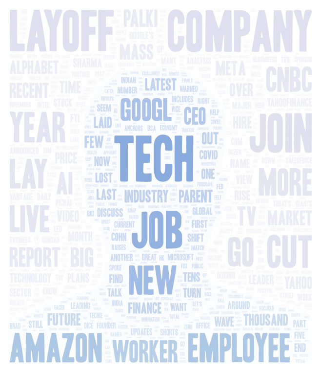

# youtube-searchterm-analysis

Export the two or more word clouds to the repository and then insert them to the readme.md. (5 PTS)
The readme.md also needs to include a url to download the result spreadsheets (csv file) of the collected data (5 PTS).

### Topic & Parameters Used in Search

For this word cloud analysis, I wanted to compare results that dealt with Tech company layoffs that have been regularly making the news for the past few years. In order to have at least a years worth of data for the algorithm to pick from, and for it to be recent data, I chose the year 2023. In order to perform this search, I fed the algorithm two search queries. The first query was "tech company layoffs 2023", and the second was "amazon company 2023".

### Why This Comparison?

When we see big layoffs in the news, front and center in the article is usually the companies name, and the company that I wanted to test in this comparison was Amazon. Throughout 2023, Amazon cut over 18,000 workers from their workforce, and this number made history for one of the largest number of layoffs in a year ever for a company that has not been completely dissolved. With that said, these companies aren't folding due to this sort of bad press on their treatment of their workers, and I wanted to figure out how a result clearly focusing on the tech layoffs would compare to a simple search of Amazon as a company in the YouTube search bar.

### Word Cloud Similarities and Differences

Ideally I wanted to draw similarities between the two word clouds to show that Amazon's record isn't being flawlessly maintained in an average search of the company, but that seems to be the case. In the second word cloud (the one that is just the search of "amazon company 2023") I made sure to highlight the word "layoff" in red, and we can see that it is extremely small compared to all of the other terms in the word cloud. This shows us that instead of people highlighting this improper treatment of their workers, they focus more on financial opportunities at Amazon or how you can make money from the service. When comparing this to the first word cloud (that focuses on "tech company layoffs 2023"), there isn't even any indicator that I wanted the results to be about Amazon, but instead Amazon becomes one of the largest words in the entire word cloud. Alongside other companies, there is clear indication that change needs to be made, but it is avoided by the algorithm when seeking out the company itself.

### Reasons For This Pattern

Some of the potential reasons as to why this came about comes down to how news is spread to begin with. Topics are always being pushed to the front of everyones attention, and within 3 days it usually fizzles out for the next big thing to talk about. Rarely does information stay at the forefront of our mind in this day and age unless it is something that is directly affecting the vast majority of people in the world (for example, COVID). When a company makes a decision like this, they know that there will be backlash against it initially but within a week they will be able to continue operating as normal without having to face any reprecussions, especially when they are a massive entity like Amazon. This means that their search results wont be people actively seeking out information that relates to what happeend with a given layoff, but instead about qualities that Amazon wants people to look for.

### Future Potential Research

A possible way I could continue this research and find a concrete answer is to see how this pattern applies to other tech companies of varying sizes. For example, if a smaller tech company was to layoff a large number of employees, would their brand see damages that Amazon managed to avoid? Or if this pattern is in general unique to Amazon and would apply to other tech giants (however this is unlikely).

### Unexpected results

I was expecting Amazon to be one of the largest words in the first word cloud and I confidently based my topic around this assumption and I was correct. What I wasn't expecting was the results from the "amazon company 2023" search. I was mainly expecting people to be reviewing products that they found on the service, but a lot of the results were people finding ways to turn a profit from buying things from the service and flipping them for a more expensive price. This does make sense after seeing the results actually appear, as drop-shipping has made the news on occasion, however this makes me curious whether or not the results of this experiment would be different if a craze like this didn't occupy a majority of the search results.

# Word Clouds

### Word Cloud #1 - Search Query "tech company layoffs 2023"

Data CSV File: [search-results-1.csv](assets/search-results-1.csv)

### Word Cloud #2 - Search Query "amazon company 2023"

Data CSV File: [search-results-2.csv](assets/search-results-2.csv)
